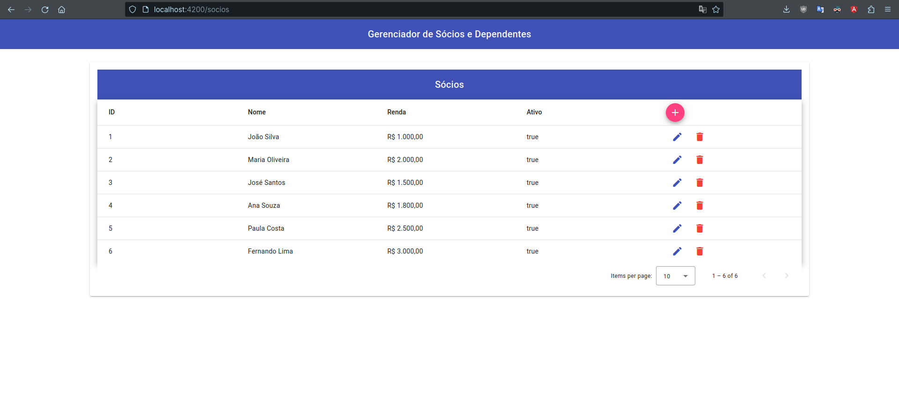
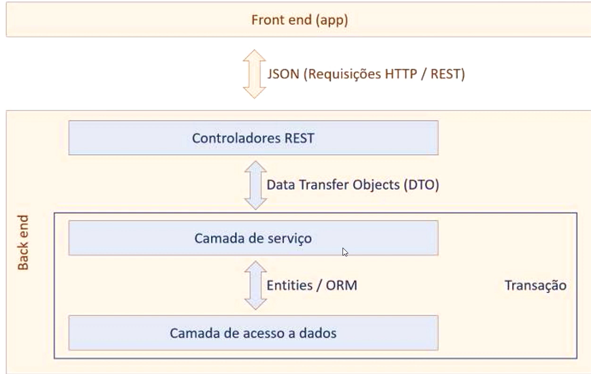
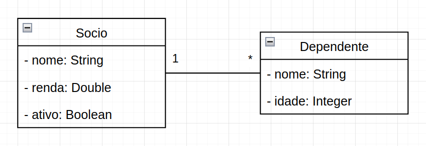
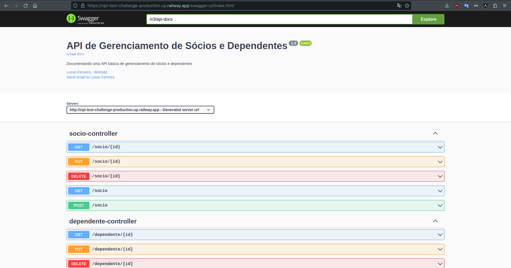

<h1 align="center"><b> Sistema de Cadastro de Sócios</b></h1>

<div align="center">


</div>

<h1 align="center"></h1>

## 📚 Sobre

Projeto criado para permitir o cadastro de sócios e dependentes no sistemas.

Acesse a aplicação em produção através [deste link](https://npi-test-challenge.vercel.app/socios)

A transação de dados ocorre em três camadas:

1) **Rest + DTO Controllers:** Data Transfer Objects - o "gateway de back-end" - disponibiliza a API.

2) **Camada de serviço:** Onde ocorre a implementação da lógica de negócios;

3) **Camada de acesso a dados:** mediada por entidades e **ORM** (Object Relational Mapping).

## 📙 Padrão de Camadas



## 📘 Modelo de Domínio



## 📝 Tecnologias e Linguagens Utilizadas

- **Java**
- **Spring Boot**
- **Maven**
- **JPA/Hibernate**
- **H2 Database**
- **PostgreSQL**
- **Docker**
- **Postman**
- **Angular**
- **Angular Material**
- **Typescript**
- **npm**
- **NodeJS**

Dependências auxiliares podem ser encontradas em: [dependencies](https://github.com/lucasferreiraz/npi-test-challenge/network/dependencies).

## 🚀 Documentação e Testes para os Endpoints:

Para ler a documentação dos endpoints utilizados na API desenvolvida e realizar os testes, basta acessar [este endereço](https://npi-test-challenge-production.up.railway.app/swagger-ui/index.html).



## 🚀 Como executar este projeto:

- ### 🐳 Usando Docker:

```bash
# Clone o repositório
$ https://github.com/lucasferreiraz/npi-test-challenge.git

# Entre na pasta
$ cd npi-test-challenge

# Run docker
$ docker compose up
```

- ### ☕ Localmente (caso não tenha o docker instalado):

```bash
# Clone o repositório
$ https://github.com/lucasferreiraz/npi-test-challenge.git

# Entre na pasta
$ cd npi-test-challenge/backend

# Se for Windows
$ mvnw spring-boot:run -Dspring-boot.run.profiles=test

# Se for Linux
$ ./mvnw spring-boot:run -Dspring-boot.run.profiles=test
```

- ### 🖌️ Frontend (se optou por rodar localmente no passo anterior)
```bash
# Entre na pasta
$ cd npi-test-challenge/frontend

# Instale as dependências
$ npm install 

# Run angular
$ ng serve
```
- ## Acesse o endereço http://localhost:4200


## 📷 [Demonstração](https://npi-test-challenge.vercel.app/socios)
### Acesse a aplicação em produção através [deste link](https://npi-test-challenge.vercel.app/socios).

**Cadastrando um novo sócio com um dependente.**


**Alterando um sócio e dependente existente e adicionando mais um dependente.**


**Removendo sócios e dependentes.**


<p align="center" style="font-weight:bolder">
    Developed with 💛 by <a href="https://github.com/lucasferreiraz">Lucas Ferreira</a>
</p>
